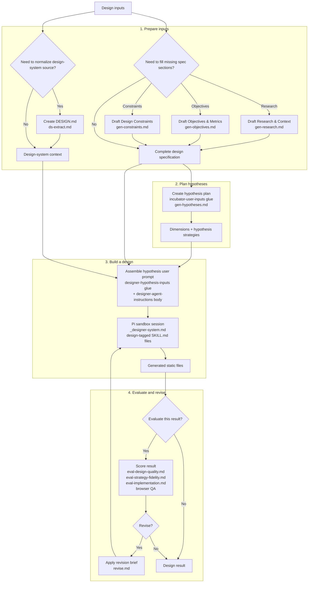

# Runtime Flow

This is the canonical reference for the app's server-side runtime flow, including prompt and skill roles. Code remains the authority:

- Prompt keys: [`src/lib/prompts/defaults.ts`](src/lib/prompts/defaults.ts)
- Prompt resolution: [`server/lib/prompt-resolution.ts`](server/lib/prompt-resolution.ts)
- Bundled prompt and skill files: [`packages/auto-designer-pi/`](packages/auto-designer-pi/)
- Session skill filtering: [`packages/auto-designer-pi/src/resource-loader.ts`](packages/auto-designer-pi/src/resource-loader.ts) and [`server/lib/skill-discovery.ts`](server/lib/skill-discovery.ts)

## Runtime Flow

This flow is independent of any interface. The canvas is one client of these server routes; another UI or service could call the same route boundaries with the same required inputs.

### Stage 3 — Hypothesis user prompt assembly

For each design run, **`buildHypothesisWorkspaceBundle()`** (used by `/api/hypothesis/prompt-bundle` and the generate path) stitches the **user** message in this order:

1. **Glue** — [`designer-hypothesis-inputs`](server/lib/prompt-templates.ts) (`DESIGNER_HYPOTHESIS_INPUTS_TEMPLATE`): leading line orients section order, then `<hypothesis>` (strategy + exploration axes / `dimension_values`), then `<design_agent_instructions>{{DESIGN_AGENT_INSTRUCTIONS}}</design_agent_instructions>`, then `<specification>` (brief, research, objectives, constraints, design system). Placeholders are filled by [`buildHypothesisPrompt()`](src/lib/prompts/hypothesis-prompt.ts).
2. **Design instructions body** — Prompt key [`designer-agent-instructions`](src/lib/prompts/defaults.ts): bundled file [`design-agent-instructions.md`](packages/auto-designer-pi/prompts/design-agent-instructions.md) (YAML frontmatter stripped via [`getPromptBody()`](server/lib/prompt-resolution.ts)). Same tagging style as other package prompts (`<how_to_think>`, `<what_to_write>`, `<tool_use>`, `<quality_bar>`, `<length>`).

The Pi **system** message is still [`_designer-system.md`](packages/auto-designer-pi/prompts/_designer-system.md) (`designer-agentic-system`); **skills** attach by session type — see the shared row below and [Skill Inventory](#skill-inventory).

## Interface Projection

The current canvas UI stores and edits the source material, then calls the server routes above. It does not own prompt order or prompt semantics. UI nodes map to server inputs and outputs; they are not the canonical prompt pipeline.

## Exploration-Axis Model

The Incubator does not merely return a list of ideas. It returns an `IncubationPlan` with a global exploration map and positioned hypothesis strategies:

- `dimensions` are the global exploration axes for the whole incubation plan.
- `dimensionValues` are one hypothesis's position on those shared axes.
- The server normalizes that relationship after parsing: blank and duplicate axes are dropped, matching position keys are canonicalized to the global axis name, unknown position keys are removed, and missing variable-axis positions become `not specified`.
- These fields keep their historical wire names for compatibility, but product language should call them **exploration axes** and **hypothesis positions**.

The model is internal: alpha users do not edit a strategy map. It exists to make hypotheses meaningfully distinct, to give the design agent the full strategic context for one selected hypothesis, and to let strategy evaluation check whether the generated artifact expressed the intended position. `dimensionValues` must not be used for output format, implementation metadata, design-system tokens, metrics, or arbitrary notes.

**Hypothesis text as MVP probe.** Incubation prompts ask the LLM to phrase each strategy so **`hypothesis` + `rationale` + `measurements`** carry a legible **artifact boundary** (smallest credible slice to test the bet—screen, flow, or tight cluster) and **`measurements`** readable as **prove/disprove checks** on the future static mock. Strategic axes stay in `dimensions` / `dimensionValues`; **scope of the build** lives in those prose fields, not in `dimensionValues`.

## Prompt Inventory

Rows follow the runtime flow above. Shared prompts appear before the task-specific steps they wrap; bundled prompts that are not currently in the active route path appear last.

| Stage | Prompt key / file | Role | Runtime path |
| --- | --- | --- | --- |
| Shared Pi session wrapper | `designer-agentic-system` / `_designer-system.md` | Base system prompt for Pi sandbox sessions: tool workflow, virtual workspace rules, skill-loading contract, output discipline. | Loaded by `server/services/pi-agent-runtime.ts` unless a caller provides an override. Used by every Pi session type. |
| Optional spec-section generation | `inputs-gen-research-context` / `gen-research.md` | Guidance for drafting the Research & Context input from the design brief and sibling sections without fabricating studies. | Inlined by `/api/inputs/generate` for `research-context`. |
| Optional spec-section generation | `inputs-gen-objectives-metrics` / `gen-objectives.md` | Guidance for drafting Objectives & Metrics from the design brief without inventing numeric targets. | Inlined by `/api/inputs/generate` for `objectives-metrics`. |
| Optional spec-section generation | `inputs-gen-design-constraints` / `gen-constraints.md` | Guidance for drafting Design Constraints from the design brief, separating non-negotiables from exploration space. | Inlined by `/api/inputs/generate` for `design-constraints`. |
| Optional design-system normalization | `design-system-extract-system` / `ds-extract.md` | Authoritative guidance for converting design-system source material into lint-friendly Google/Stitch `DESIGN.md`. | Inlined by `/api/design-system/extract` inside `<design_md_extraction_guidance>`. |
| Incubation | `incubator-user-inputs` / glue template | Structural wrapper for assembled spec context, reference designs, existing hypotheses, and requested hypothesis count. It contains no behavioral guidance. | Loaded by `/api/incubate`, then filled by `buildIncubatorUserPrompt()`. |
| Incubation | `hypotheses-generator-system` / `gen-hypotheses.md` | Axes + strategies: infers product scope when unstated; frames each hypothesis as **MVP market-fit probe** with **`measurements` as design-inspectable prove/disprove checks** and prose that implies **artifact boundary**. | Inlined by `/api/incubate` inside `<hypotheses_generator_guidance>`. |
| Optional incubation prelude | `incubator-brainstorm-system` / `gen-brainstorm.md` | Divergent brainstorm: 10–15 categorically different product directions from the design brief, anti-censorship framing ("the wilder the better"). | Inlined by [`server/lib/incubator-brainstorm.ts`](server/lib/incubator-brainstorm.ts) when `promptOptions.brainstormFirst === true`. |
| Optional incubation prelude | `incubator-curation-system` / `gen-curation.md` | Convergent curation: pick five from the brainstorm pool for **maximum spread** across the solution space (not maximum plausibility). Output is stitched into the design brief as a `<product_shape_candidates>` block before the incubator stage runs. | Inlined by [`server/lib/incubator-brainstorm.ts`](server/lib/incubator-brainstorm.ts) immediately after the brainstorm stage when the toggle is set. |
| Hypothesis prompt bundle | `designer-hypothesis-inputs` / glue template | Short orienting lead-in, then structural XML only: hypothesis block → `<design_agent_instructions>{{DESIGN_AGENT_INSTRUCTIONS}}</design_agent_instructions>` → full `<specification>` (brief through design system—no embedded image block). Behavioral text lives in `design-agent-instructions.md`, not in the glue. | `getPromptBody('designer-hypothesis-inputs')` + `buildHypothesisPrompt()` inside `buildHypothesisWorkspaceBundle()` for `/api/hypothesis/prompt-bundle` and downstream generate. |
| Hypothesis-stage design instructions | `designer-agent-instructions` / [`design-agent-instructions.md`](packages/auto-designer-pi/prompts/design-agent-instructions.md) | Executes the bet: **aligns artifact breadth** with hypothesis + spec (no default one-pager when flow-shaped), sizes MVP for **`measurements`** to be checkable, tooling, **quality_bar**. | Loaded with the glue via `Promise.all` in `buildHypothesisWorkspaceBundle()`; interpolated as `{{DESIGN_AGENT_INSTRUCTIONS}}`. |
| Evaluation | `evaluator-design-quality` / `eval-design-quality.md` | LLM evaluator rubric for subjective design quality, originality, craft, and usability. | Loaded by `runEvaluationWorkers()` when evaluation is active. |
| Evaluation | `evaluator-strategy-fidelity` / `eval-strategy-fidelity.md` | LLM evaluator rubric for fidelity to hypothesis, objectives, constraints, exploration-axis position, and design-system guidance. | Loaded by `runEvaluationWorkers()` when evaluation is active. |
| Evaluation | `evaluator-implementation` / `eval-implementation.md` | LLM evaluator rubric for static frontend implementation quality: structure, semantics, responsiveness, JavaScript hygiene, and whether the code expresses the bet. | Loaded by `runEvaluationWorkers()` when evaluation is active. |
| Revision | `designer-agentic-revision-user` / `revise.md` | Guidance for editing an existing generated design in response to evaluation feedback while preserving the hypothesis. | Loaded by `runAgenticWithEvaluation()` before revision rounds. |
| Bundled, currently inactive | `design-system-extract-user-input` / `ds-extract-input.md` | User-message wording for design-system extraction from written material and screenshots. | PromptKey-resolvable package content; the current `/api/design-system/extract` route assembles its user message in route code. |
| Bundled, currently inactive | `agents-md-file` / `artifact-conventions.md` | Static artifact conventions for sandbox-built HTML/CSS/JS: preview entry, framework restrictions, CDN/font rules, file organization, and local asset expectations. | PromptKey-resolvable package content; not currently inlined by a runtime route. |
| Bundled, currently inactive | `ds-generate.md` | Companion methodology for inferring a complete `DESIGN.md` when source material is sparse. | Bundled package prompt content; not currently mapped to a `PromptKey` or called by a runtime route. |

## Skill Inventory

All checked-in skills currently carry the `design` tag, so they are visible only to design Pi sessions. Incubation, inputs-gen, design-system extraction, and evaluation sessions currently receive no checked-in skills unless new skills are tagged for those session types.

| Skill key / name | Role | Visible session |
| --- | --- | --- |
| `accessibility` / Accessibility basics | Guidance for semantic HTML, keyboard access, screen readers, labels, landmarks, headings, contrast, and focus. | `design` |
| `design-generation` / Design generation | Guided artifact breadth for **hypothesis MVP**: static HTML/CSS/JS that embodies the bet so **`measurements`** are inspectable on shipped pages; file organization and validation expectations. | `design` |
| `design-quality` / Design quality basics | Guidance for layout, typography, spacing, hierarchy, scanability, density, and visual craft. | `design` |

## Editing Contract

Prompt and skill bodies are repo-owned content. Edit the package files directly, run the relevant tests, and snapshot changed prompt/skill/rubric content with `pnpm snap` as described in [USER_GUIDE.md](USER_GUIDE.md#version-history). Do not duplicate prompt roles in other docs; link here.
